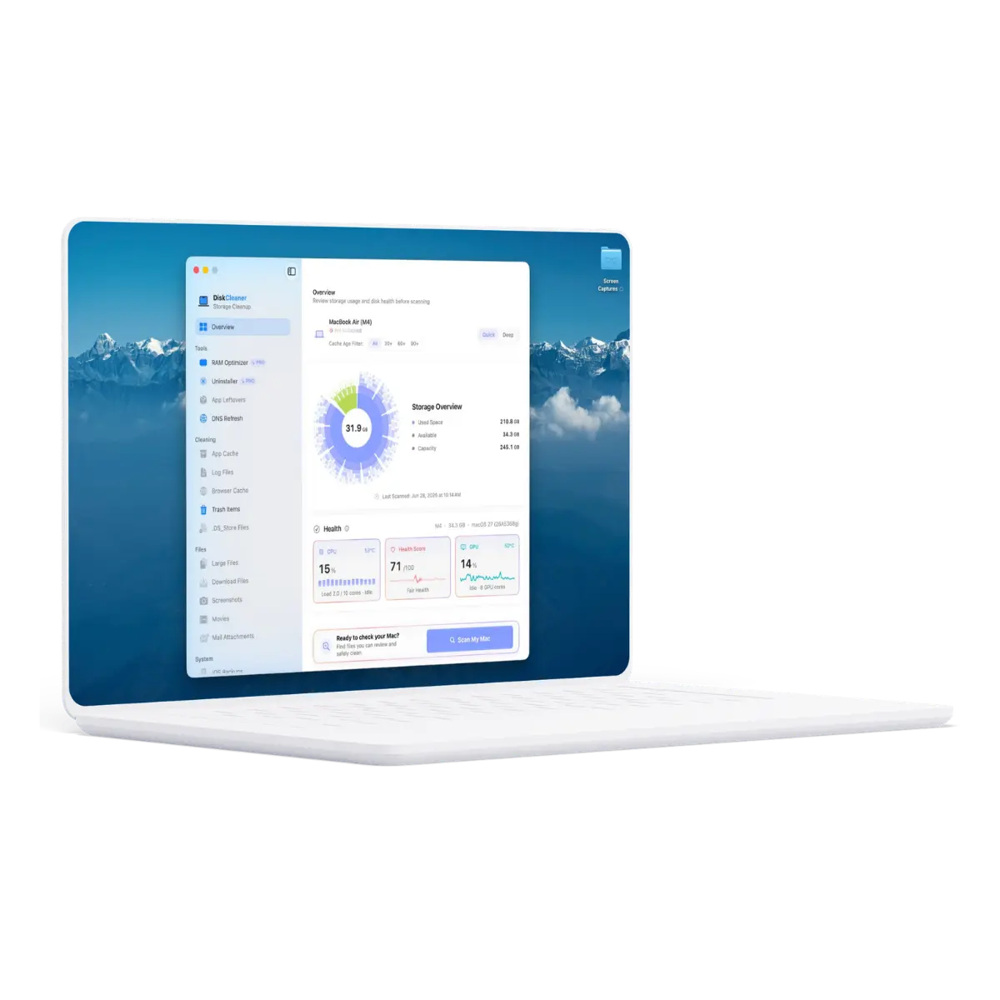
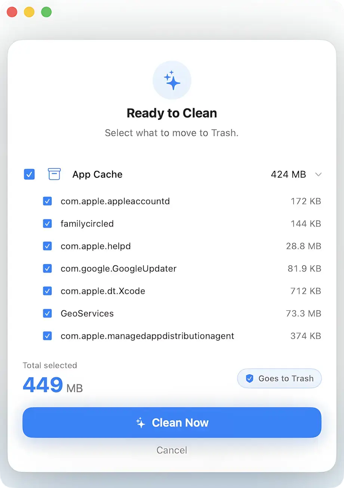
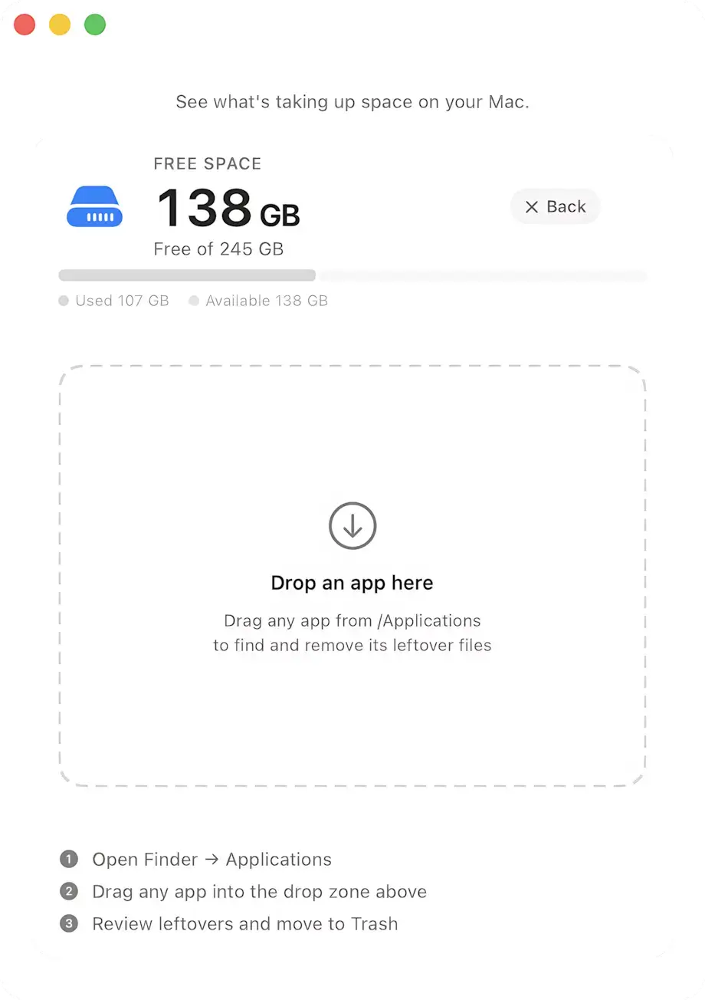

# DiskCleaner for Mac

DiskCleaner is a privacy-first macOS cleanup app built around one rule: **show everything before cleanup**.

It helps recover storage from caches, logs, temporary files, browser data, and app leftovers while keeping users in control of every action.

## Website

- Main site: https://www.diskcleaner.pro/
- Download page: https://www.diskcleaner.pro/#download
- Features page: https://www.diskcleaner.pro/#features
- Blog: https://www.diskcleaner.pro/blog

## Core App Features

- Full file preview before cleanup
- Trash-first cleanup workflow (recoverable)
- Local-first scanning and processing
- Zero background cleanup jobs
- Multi-browser cache cleanup support
- Developer data cleanup (for example Xcode and package caches)
- App uninstaller that finds common leftover files

## Screenshots

### Main Scan View

### Zero-Decision Cleaning

### App Uninstaller

Direct assets:

- `src/assets/DiskCleaner.webp`
- `src/assets/DiskCleaner_ZeroDecision.webp`
- `src/assets/DiskCleaner_Uninstaller.webp`

## Product Principles

- Transparency over automation
- Safety over aggressive deletion
- Performance without always-on processes
- Privacy without file-content uploads for normal cleanup workflows

## What DiskCleaner Cleans

DiskCleaner focuses on common storage-heavy categories such as:

- Cache files
- Logs
- Temporary files
- Browser data
- Developer artifacts
- App leftovers after uninstall

## This Repository

This repository contains the **official DiskCleaner website** (marketing site + blog), built with:

- React
- TypeScript
- Vite

## Contact

- Support: support@diskcleaner.pro
- Website: https://www.diskcleaner.pro/
