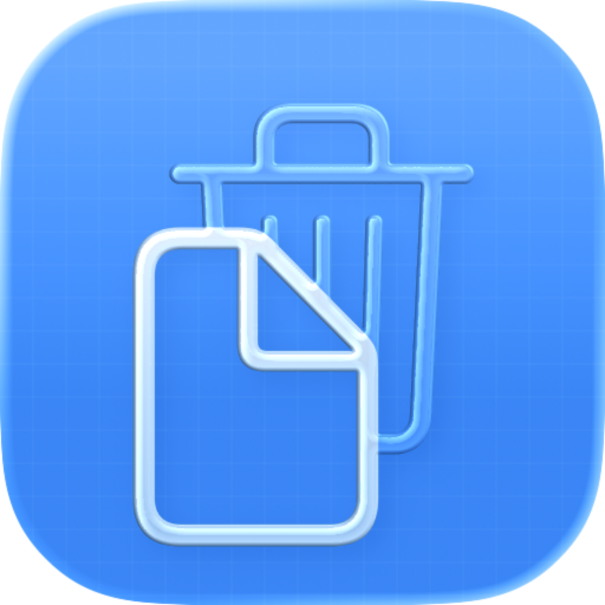

# DiskCleaner for Mac

<p align="center">
  
</p>

<h1 align="center">DiskCleaner Website</h1>

<p align="center">
  The official marketing site for <strong>DiskCleaner for Mac</strong>.<br />
  A website built to explain the product the same way the app works: clearly, intentionally, and without black boxes.
</p>

<p align="center">
  <a href="https://www.diskcleaner.pro"></a>
  <a href="https://www.diskcleaner.pro/#download"></a>
  
  
</p>

---

## What This Repo Represents

DiskCleaner is a native macOS cleanup app built around one principle: show people exactly what will happen before anything moves.

This repository is the website layer of that product story. It does two jobs at the same time:

- explains what the macOS app does, in plain language
- turns product trust into a fast, searchable, polished web experience

The app and the website share the same point of view: clarity over hype, control over automation, and safety over aggressive deletion.

## The Product Behind The Website

DiskCleaner for Mac helps people recover storage without guessing.

- Shows every file before cleanup
- Lets users keep or uncheck specific items
- Sends removals to macOS Trash instead of permanently deleting
- Scans seven cleanup categories in parallel
- Cleans browser caches without touching passwords, bookmarks, or history
- Helps developers remove large storage drains like DerivedData, simulators, npm caches, and more
- Includes an app uninstaller that finds leftover files across common Library locations
- Offers a menu bar utility for fast visibility into available storage
- Stays local-first with no analytics, no account, and no routine network activity

## What The Website Ships

This site is not a generic landing page. It is a product surface built to make DiskCleaner feel credible before the download.

- Focused marketing pages for product, trust, help, about, and editorial policy
- Blog architecture for search-led education around Mac storage problems
- Route-aware metadata updates for titles, descriptions, Open Graph, and Twitter cards
- Sitemap and robots configuration for discoverability
- `llms.txt` and `llms-full.txt` for AI-readable product context
- Static generation after build for fast deployment
- Compressed production assets and WebP imagery
- Waitlist modal infrastructure driven by environment configuration

## Why The Presentation Feels Apple-Like

The message discipline matters here.

DiskCleaner is a paid Mac utility, so the website avoids noisy growth language and explains the product with restraint. The copy is designed to feel calm, premium, and specific. The visual language in the site and in this README follows the same logic: generous spacing, few but deliberate emphasis points, and product proof instead of feature spam.

## Website Architecture

| Layer | What it does |
| --- | --- |
| React 19 + TypeScript | Drives the application structure with a modern typed frontend stack |
| Vite 7 | Keeps development fast and outputs a lean production bundle |
| React Router 7 | Handles page-level routing across marketing and blog surfaces |
| Tailwind CSS + custom CSS | Supports the site layout, responsive sections, and refined presentation details |
| Postbuild SSG script | Generates static output after the main build |
| SEO utilities | Applies per-page metadata, canonical URLs, social images, and schema control |
| Content markdown | Powers long-form blog content around Mac cleanup and storage education |

## Protected Release Download

`public/downloads/**` is excluded from normal deployment commits so the published DMG stays at its stable URL. After cloning the repository, enable the versioned commit and push guards once:

```sh
npm run setup:hooks
```

Release-DMG replacements are intentionally handled as separate, explicit changes.

## Product And Website Links

- Main site: https://www.diskcleaner.pro/
- Download section: https://www.diskcleaner.pro/#download
- Features section: https://www.diskcleaner.pro/#features
- Trust page: https://www.diskcleaner.pro/trust
- Blog: https://www.diskcleaner.pro/blog
- Help: https://www.diskcleaner.pro/help

## Screenshot

<p align="center">
  
</p>

## Contact

- Support: customersupport@diskcleaner.pro
- Website: https://www.diskcleaner.pro/
